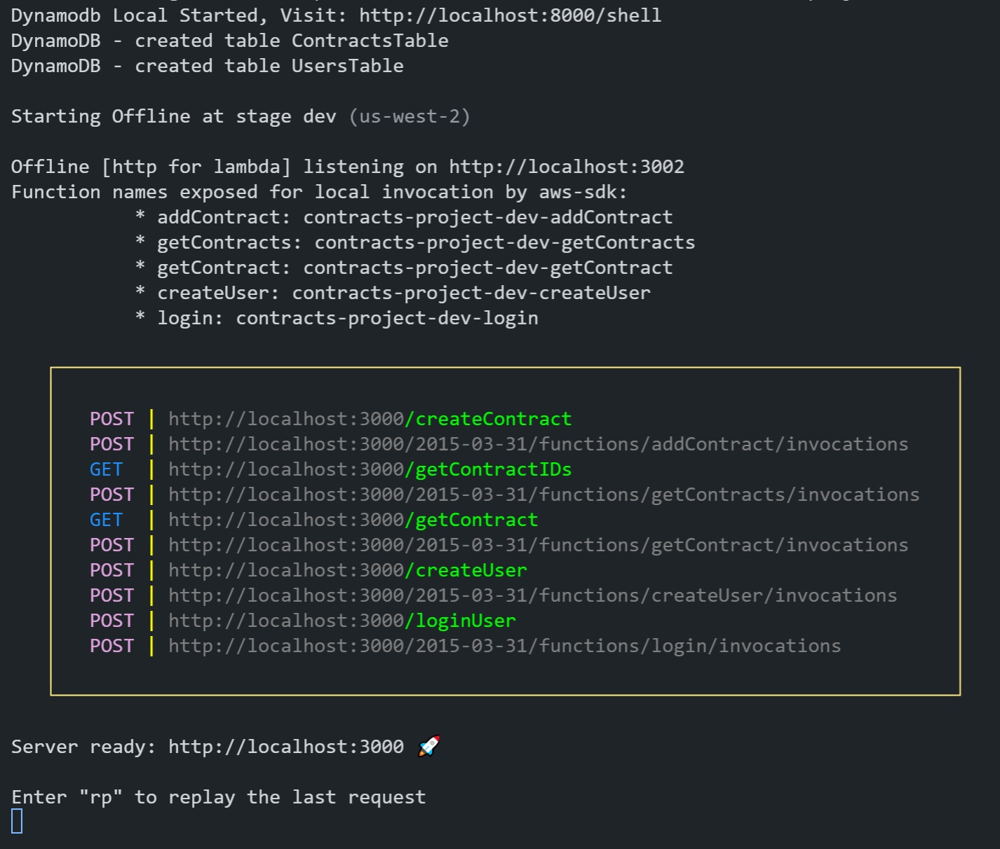

# GET & POST Contracts API

## First steps

Before starting, please make sure to run the following commands from the folder you've downloaded the repo:

`~$ sls dynamo install`\
`~$ npm init`

- The first command will install dynamodb locally for your project
- The second one will install all the project's dependencies

## Start

### Run the API

In order to start the local environment, run the following command:

`~$ serverless offline start`

- This command will allow you to start working with the API at localhost:3000
- Addicionally, it will create a local dynamodb database and its tables at the port 8000

If everything is fine, you should see something like this in your console:

### Create & Log a user

Since each "contract" endpoint is protected with a JWT token, first create a new user:

`POST http://localhost:3000/createUser` \
`Payload: { "username": "[Create your username]", "password": "[Create your password]" }`

Then get your JWT token by logging in:

`POST http://localhost:3000/loginUser` \
`Payload: { "username": "[Put your username]", "password": "[Put your password]" }`

- This last endpoint will give you a JWT token, wich you will use in order to make the requests to the Contracts endpoints
- This JWT token expires after 1 minute. After that time, you'll need to log in again and get a new token

## Make Requests to Contracts Endpoints

### Create a new contract

We highgly recommend to start adding some information to your dynamodb database.\
Please, add a new contract like this:

`POST http://localhost:3000/createContract` \
`Payload: { "contractName": "[Write the name of this contract]" }`

- Be aware that you have to use your JWT token in order to use this endpoint
- If the payload doesn't have the contractName in its body, it'll reject the request
- If the token has more than 1 minute, it'll show you a massage of "Unauthorized"

### Get the list of all contracts

In order to see all the contract IDs, you must use the /getContractIDs endpoint, like this:

`GET http://localhost:3000/getContractIDs`

- Be aware that you have to use your JWT token in order to use this endpoint
- If the token has more than 1 minute, it'll show you a massage of "Unauthorized"

### Get all the information of a specific contract

If you'd like to know more details about any contract, use this /getContract endpoint:

`GET http://localhost:3000/getContract?id={here you will paste the ID you get from /getContractIDs endpoint}`

- Notice that you'll need to copy the ID first before make this request, and paste it after ?id= (without the curly braces)
- Be aware that you have to use your JWT token in order to use this endpoint
- If the token has more than 1 minute, it'll show you a massage of "Unauthorized"
